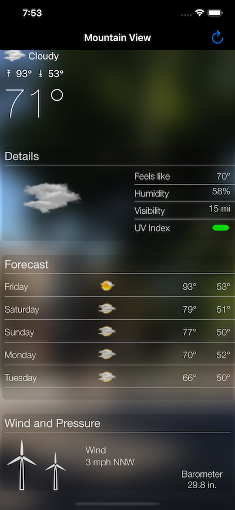

# WeatherSwift

WeatherSwiftUI is an iOS weather app whose UI is similar to parts of the Yahoo! Weather app. The UI is all constraint-based, done programatically. Basically nothing in the storyboard. It uses the AccuWeather API for data and you can get a free low-use (50 calls per day) key here: https://developer.accuweather.com/getting-started (start with Register button at the top of the screen).

As a sample app it just displays the weather for one location.

|

## License

WeatherSwift is licensed under the MIT License. See the LICENSE file for more information, but basically this is sample code and you can do whatever you want with it.